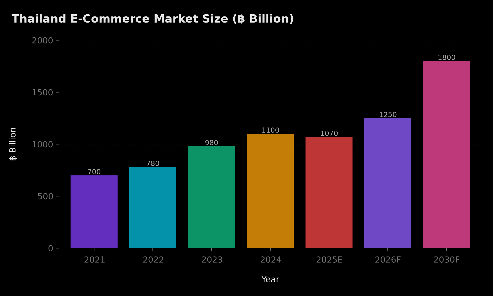
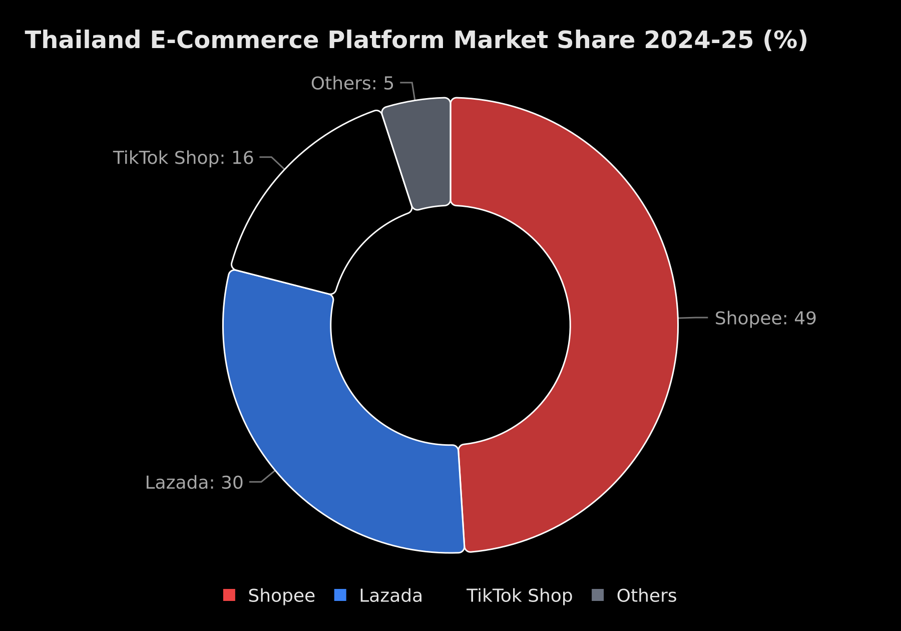
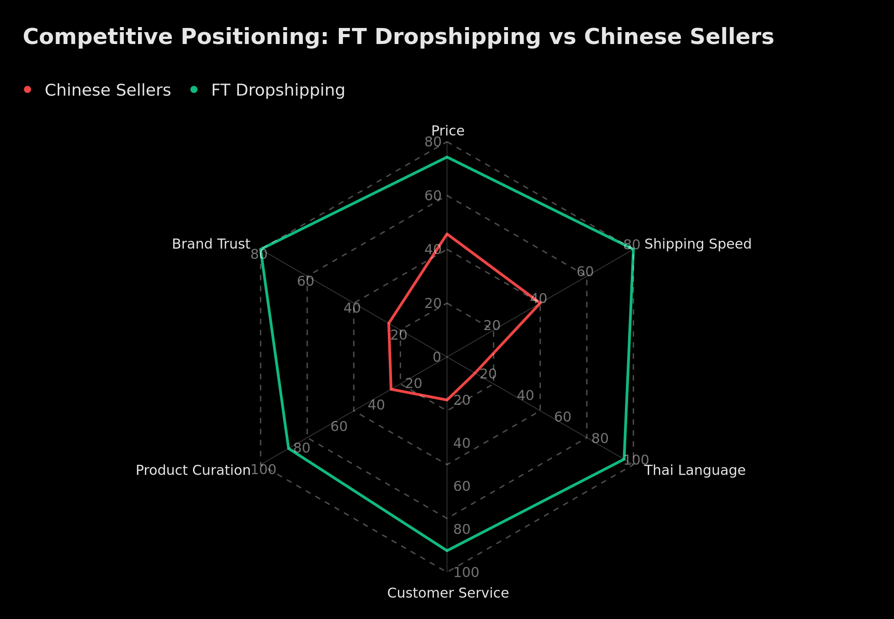
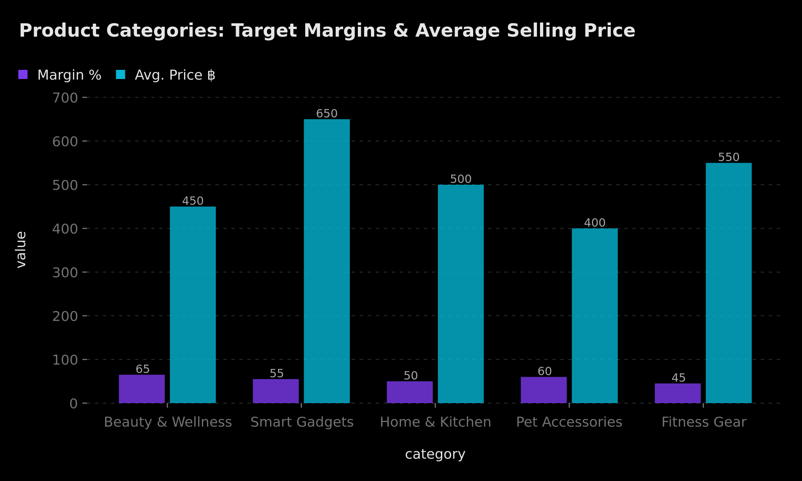
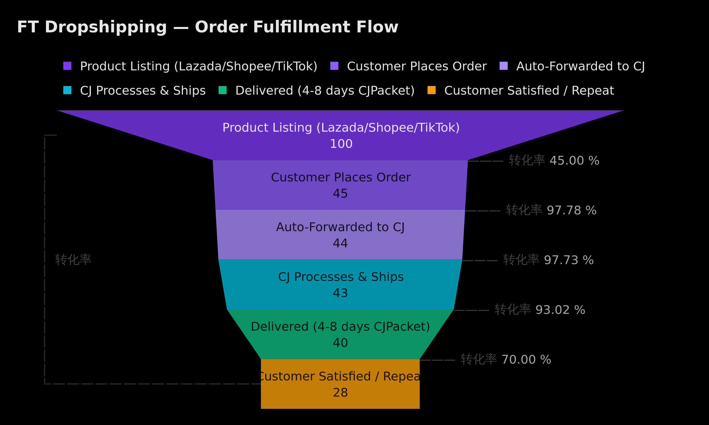
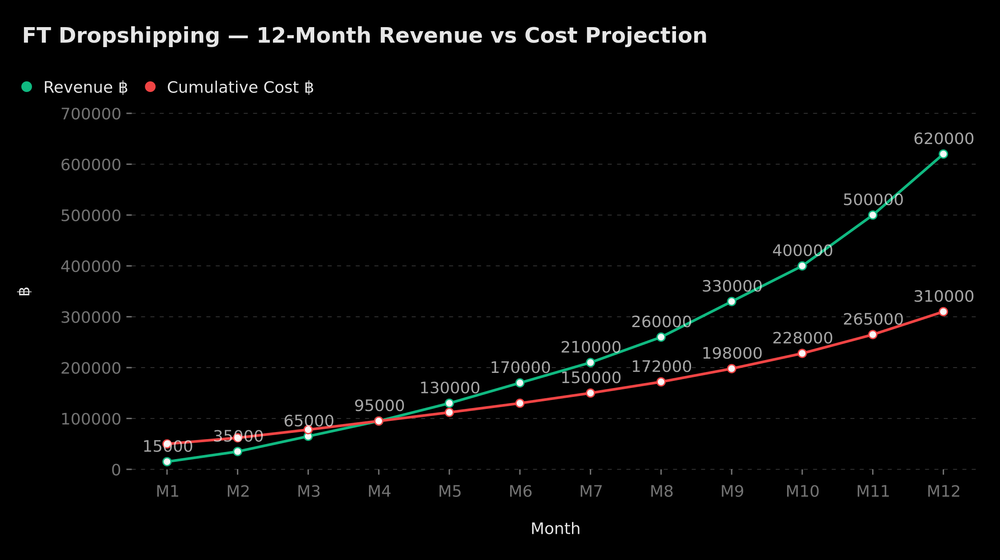

# FT Dropshipping — Business Plan 2026

## Abstract

FT Dropshipping is a Thai-language e-commerce venture leveraging CJ Dropshipping's global fulfillment infrastructure to sell curated consumer products to Thai consumers across Shopee, Lazada, and TikTok Shop. The business enters a **฿1+ trillion Thai e-commerce market** growing at 14%+ CAGR, where consumer trust, localized service, and product curation are increasingly valued over raw price competition. With **zero inventory risk**, a ฿50,000 startup investment, and target gross margins of **45–65%**, the model is designed for capital efficiency and rapid iteration. Break-even is projected at **Month 3–4**, with Month 12 revenue reaching **฿620,000/month** across five high-margin product categories: beauty & wellness, smart gadgets, home & kitchen, pet accessories, and fitness gear. FT Dropshipping's core differentiation — **native Thai content, responsive local customer service, and expert product curation** — directly addresses the trust gap that Chinese cross-border sellers cannot close.

## 1. Introduction

### 1.1 Background

Thailand's e-commerce sector has undergone a structural transformation, evolving from a price-driven marketplace to a trust-driven ecosystem. In 2024, the market hit **฿1.1 trillion** in revenue — a 14% year-over-year increase from ฿980 billion in 2023 [citation:Asian News Network](https://asianews.network/thai-shoppers-flock-online-amid-economic-slowdown-as-shopee-lazada-and-tiktok-rake-in-billions/). Over **16 million Thais** are now active online buyers, with more than **300 million product listings** across platforms [citation:Nation Thailand](https://www.nationthailand.com/business/economy/40058399). The market is projected to reach **฿1.8 trillion by 2030** at a CAGR exceeding 14% [citation:Nation Thailand](https://www.nationthailand.com/business/tech/40062978).

This growth is propelled by three converging forces: mobile-first shopping behavior (92% of Thai consumers shop online, 95% via mobile), the rise of social commerce (38% of e-commerce transactions now originate from social platforms), and an "Impatience Economy" demanding speed, trust, and quality over the cheapest price [citation:Hashmeta](https://hashmeta.com/blog/social-media-landscape-thailand-2025-key-stats-platforms/).

### 1.2 Purpose

This business plan outlines the strategy, operations, and financial projections for **FT Dropshipping** — a zero-inventory Thai e-commerce business that serves as both a standalone profit center and a proof-of-concept for mhoooo's AI-powered business automation capabilities.

### 1.3 Methodology

Analysis draws on primary market data from THECA (Thai E-Commerce Association), Cube Insights, Momentum Works, Milieu Insight, Priceza, YouGov BrandIndex, and platform-specific GMV reports. Financial projections are modeled using documented CJ Dropshipping cost structures and Thai marketplace fee schedules.

## 2. Market Analysis — Thailand E-Commerce Landscape

### 2.1 Market Size & Growth Trajectory



| Metric | Value | Source |
|--------|-------|--------|
| 2023 Market Size | ฿980 billion | Priceza |
| 2024 Market Size | **฿1.1 trillion** (+14% YoY) | Priceza / THECA |
| 2025 Projection | ฿1.07 trillion | THECA |
| 2026 Projection | ฿1.25 trillion | CUBE Insights |
| 2030 Projection | **฿1.8 trillion** | CUBE Insights |
| CAGR (2024–2030) | **>14%** | CUBE Insights |
| Active Online Buyers | 16+ million | THECA |
| Product Listings | 300+ million | THECA |
| ASEAN Ranking | **#2** (behind Indonesia) | Momentum Works |
| Mobile Shopping Rate | 92% online, 95% mobile | Industry reports |

Thailand's e-commerce market has achieved a critical inflection point, transitioning from volume-driven growth to **value-driven expansion**. The share of online mall-based transactions increased from 12% in 2020 to 30% in 2024 and is projected to reach 55% by 2030 [citation:Bangkok Post](https://www.bangkokpost.com/business/general/3205325/lazada-rides-tradeup-trend-in-thai-market). This structural shift signals that Thai consumers are actively trading up — prioritizing authenticity, brand trust, and product quality over the cheapest available option. The "Confidence Commerce" era identified by Cube Insights reveals that **66% of consumers now prioritize quality and trust over price**, and **67% are willing to pay 5–10% more for genuine branded products** [citation:Nation Thailand](https://www.nationthailand.com/business/tech/40062978). This consumer psychology creates a fundamentally different competitive dynamic from the race-to-the-bottom pricing wars that characterized the market five years ago. For a curated dropshipping operation like FT Dropshipping, this trade-up trend is structurally favorable: consumers are willing to pay margin-supporting premiums when they trust the seller, the product descriptions are in their language, and customer service is responsive. The market is no longer asking "who is cheapest?" — it is asking "who can I trust?"

> **The ฿1+ trillion Thai e-commerce market rewards trust over price — the single most important structural tailwind for a Thai-localized dropshipper competing against anonymous Chinese sellers.**

### 2.2 Platform Landscape — The Big Three



| Platform | Market Share | Key Strengths | Seller Fees (All-In) |
|----------|-------------|---------------|---------------------|
| **Shopee** | ~49% | Largest user base, 75% of Thai buyers use it, strongest flash sale events (9.9 = 1M+ orders in 30 min) | ~13–15% |
| **Lazada** | ~30% | LazMall premium positioning, strongest brand trust score, Alibaba logistics backbone | ~12–14% |
| **TikTok Shop** | ~16% | Fastest growth (+500% live GMV), discovery commerce, 32.5M Thai users, avg 68 min/day | ~10–13% |
| Others | ~5% | LINE Shopping, Grab, Amazon, D2C | Varies |

Thailand's e-commerce is a three-horse race. **Shopee** commands the largest share at approximately 49% of GMV, used by 75% of Thai online buyers [citation:LinkedIn](https://www.linkedin.com/posts/super-solution-system_thailandecommerce-marketplacefees-digitalstrategy-activity-7343537761666199552-7UxA). **Lazada** holds second position at ~30%, differentiated by its LazMall authenticity play and "confidence commerce" positioning [citation:Bangkok Post](https://www.bangkokpost.com/business/general/3205325/lazada-rides-tradeup-trend-in-thai-market). The explosive entrant is **TikTok Shop**, which generated **$5.4 billion in GMV in H1 2025 alone** for its Thailand site — approaching its full-year 2024 volume in just six months [citation:EchoTik Report](https://api.kjnotice.com/storage/reports/20250905/92f6873ef31553b2313169858c235573.pdf). With 32.5 million active Thai TikTok users spending an average of 68 minutes daily on the platform, TikTok Shop has fundamentally altered the discovery-to-purchase funnel by making shopping an entertainment experience [citation:Hashmeta](https://hashmeta.com/blog/social-media-landscape-thailand-2025-key-stats-platforms/).

For FT Dropshipping, the multi-platform strategy is not optional — it is existential. Each platform serves a different funnel stage: **TikTok Shop** for discovery and impulse purchases through short-video and live commerce, **Shopee** for price-conscious comparison shoppers who browse across sellers, and **Lazada** for consumers seeking premium curation and brand assurance. The platform fee structures (10–15% all-in) must be factored into product pricing from Day 1, but the access to 16+ million active buyers without building standalone infrastructure makes the trade-off overwhelmingly positive for a bootstrapped operation. The key strategic insight is that **live commerce conversion rates average 7.4%** across platforms — significantly higher than traditional e-commerce benchmarks — meaning that Thai-language live selling capability becomes a disproportionate competitive advantage.

> **A multi-platform approach across Shopee, Lazada, and TikTok Shop provides access to 90%+ of Thai online buyers while diversifying platform dependency risk.**

### 2.3 Social Commerce & The Discovery Engine

Social commerce now accounts for **38% of all e-commerce transactions in Thailand** [citation:Hashmeta](https://hashmeta.com/blog/social-media-landscape-thailand-2025-key-stats-platforms/), making it one of the highest social commerce penetration rates in ASEAN. The shift from "search-based shopping" to "zero-friction discovery" is the defining trend of 2025–2026 [citation:LinkedIn](https://www.linkedin.com/posts/nruangchan_opentowork-ecommercestrategy-thailandmarket-activity-7401282793206374400-sqHJ).

Key social commerce data points:
- **Facebook**: 50M+ Thai users, CPM of ฿10–100, CPC of ฿2–30 — among the lowest in ASEAN [citation:Northern Kites](https://northernkites.com/the-ultimate-guide-to-facebook-ads-thailand)
- **TikTok**: 32.5M active users, 150,000+ Thai content creators, 500% live commerce GMV growth [citation:HireGrowth](https://hiregrowth.ai/blogs-hiregrowth.ai/why-tiktok-shop-thailand-is-growing-faster-than-traditional-e-commerce-in-2025)
- **Live shopping conversion**: 7.4% average — 3–5x higher than standard e-commerce
- **Affiliate marketing**: Rising force in 2025, promoters share links across social media for commissions

The convergence of content and commerce creates an asymmetric opportunity for operators who can produce engaging Thai-language video content, host live selling sessions, and build community trust — precisely the capabilities FT Dropshipping is designed to deliver.

## 3. Business Model

### 3.1 Model Overview

FT Dropshipping operates a **zero-inventory, multi-channel dropshipping model** using CJ Dropshipping as the primary fulfillment partner.

```
┌─────────────────────────────────────────────────────────┐
│                    FT DROPSHIPPING                       │
│              Zero-Inventory Business Model               │
│                                                         │
│  ┌──────────┐   ┌──────────┐   ┌──────────────┐        │
│  │  Shopee  │   │  Lazada  │   │  TikTok Shop │        │
│  └────┬─────┘   └────┬─────┘   └──────┬───────┘        │
│       │              │                │                  │
│       └──────────────┼────────────────┘                  │
│                      ▼                                   │
│            ┌─────────────────┐                           │
│            │  FT Dropshipping │                          │
│            │   (Order Hub)    │                          │
│            └────────┬────────┘                           │
│                     ▼                                    │
│            ┌─────────────────┐                           │
│            │ CJ Dropshipping │                           │
│            │  (Fulfillment)  │                           │
│            └────────┬────────┘                           │
│                     ▼                                    │
│            ┌─────────────────┐                           │
│            │   CJPacket TH   │                           │
│            │  (4-8 Day Ship) │                           │
│            └────────┬────────┘                           │
│                     ▼                                    │
│            ┌─────────────────┐                           │
│            │  Thai Customer  │                           │
│            └─────────────────┘                           │
└─────────────────────────────────────────────────────────┘
```

### 3.2 Core Model Mechanics

| Component | Detail |
|-----------|--------|
| **Supplier** | CJ Dropshipping (3M+ SKU catalog, TH warehouse, free storage) |
| **Sales Channels** | Shopee Thailand, Lazada Thailand, TikTok Shop Thailand |
| **Inventory** | Zero — CJ ships direct to customer per order |
| **Order Flow** | Customer order → Auto-forward to CJ → CJ processes (1–4 days) → CJPacket ships (4–8 days to TH) → Delivered |
| **Payments** | Platforms collect → payout to FT after delivery confirmation |
| **Returns** | 7-day return policy managed by FT, cost absorbed in margin buffer |
| **Capital Required** | ฿50,000 startup (ads, samples, branding) |

### 3.3 Revenue Model

```
Revenue = (Product Selling Price) × (Units Sold)
Gross Profit = Revenue - COGS - Shipping - Platform Fees
Net Profit = Gross Profit - Marketing - Operations
```

**Unit Economics Example — Portable Neck Fan (฿499 selling price):**

| Line Item | Amount (฿) | % of Revenue |
|-----------|-----------|-------------|
| Selling Price | 499 | 100% |
| Product Cost (CJ) | (90) | 18% |
| Shipping (CJPacket TH) | (45) | 9% |
| Platform Fee (~13%) | (65) | 13% |
| **Gross Profit** | **299** | **60%** |
| Marketing (est. 15%) | (75) | 15% |
| **Net Profit per Unit** | **224** | **45%** |

### 3.4 Why CJ Dropshipping

| Feature | CJ Dropshipping | AliExpress (Alternative) |
|---------|-----------------|--------------------------|
| Shipping to TH | **4–8 days** (CJPacket) | 14–25 days |
| Processing Time | 1–4 business days | 3–7+ days |
| Monthly Subscription | **Free** | N/A |
| Minimum Order | **None** | Varies |
| Custom Packaging | Available (~$1.67/unit) | Rare |
| Thai Warehouse | **Yes** | No |
| API Integration | Shopee, Lazada, TikTok | Limited |
| CNY Operations | **Staggered (1-day shutdown)** | 2–4 weeks shutdown |

CJ Dropshipping's Thailand warehouse presence and CJPacket shipping line reduce delivery times to **4–8 days** — comparable to domestic sellers and dramatically faster than the 2–4 week standard from Chinese AliExpress sellers [citation:CJ Dropshipping](https://cjdropshipping.com/blogs/cj-news/What-is-CJdropshipping). This speed advantage directly addresses the #1 customer complaint about cross-border dropshipping and supports the premium pricing necessary for healthy margins.

## 4. Competitive Advantage

### 4.1 Competitive Positioning



FT Dropshipping's competitive moat is built on five pillars that Chinese cross-border sellers structurally cannot replicate:

### 4.2 The Five Pillars

**1. Native Thai-Language Content**
- All product listings written in natural Thai — not machine-translated
- Thai-language video content for TikTok Shop and live selling
- Cultural nuance in product descriptions, sizing guides, and usage instructions
- **Why it matters**: 66% of Thai consumers prioritize trust, and language is the #1 trust signal in online shopping

**2. Responsive Local Customer Service**
- Thai-language LINE OA and platform chat support
- Same-timezone response (no 12-hour lag to China)
- Proactive order tracking updates in Thai
- **Why it matters**: 73% of Thai consumers value easy returns and support for unfamiliar brands [citation:Nation Thailand](https://www.nationthailand.com/business/tech/40062978)

**3. Curated Product Selection**
- Hand-picked products tested for Thai market fit (climate, aesthetics, sizing)
- Maximum 50–100 SKUs at any time (vs. Chinese sellers listing 10,000+ without curation)
- Focus on trending categories validated by social listening and platform data
- **Why it matters**: Curation creates brand perception — a shop with 50 excellent products outsells a warehouse of 10,000 mediocre ones

**4. Speed-to-Market via CJPacket**
- 4–8 day delivery to Thailand vs. 14–25 days from standard Chinese shipping
- CJ Thailand warehouse for fastest-moving SKUs (potential 2–3 day domestic delivery)
- Real-time tracking in Thai
- **Why it matters**: The "Impatience Economy" penalizes slow shipping with cart abandonment and negative reviews

**5. Trust Architecture**
- Thai business registration (when scaled)
- Consistent brand identity across all platforms
- Social proof through Thai influencer partnerships and UGC
- **Why it matters**: The shift to "Confidence Commerce" means Thai buyers increasingly choose sellers they feel are accountable and reachable

### 4.3 SWOT Analysis

| | **Favorable** | **Unfavorable** |
|---|---|---|
| **Internal** | **Strengths**: Zero inventory risk, Thai native content, low startup cost, multi-platform presence, fast CJPacket shipping | **Weaknesses**: No brand equity at launch, dependent on CJ's supply chain, limited capital for ad spend, single-person operation initially |
| **External** | **Opportunities**: ฿1T+ growing market, TikTok Shop explosive growth, social commerce 38% penetration, consumer shift to trust-based buying | **Threats**: Chinese seller price competition, rising platform fees (13–15%), CJ supply disruptions, regulatory changes (import duties), Temu entry into Thai market |

## 5. Product Strategy

### 5.1 Category Selection



FT Dropshipping targets five product categories selected for their intersection of **high margins, strong Thai demand, visual/social appeal, and CJ Dropshipping availability**:

| Category | Price Range (฿) | Target Margin | Demand Signal | Social Commerce Fit |
|----------|----------------|---------------|---------------|-------------------|
| **Beauty & Wellness** | 300–800 | 55–65% | #1 TikTok Shop category (18% GMV), 81% of consumers buy beauty online | ★★★★★ |
| **Smart Gadgets** | 400–1,000 | 45–55% | High engagement on unboxing/demo videos, tech-savvy youth demand | ★★★★☆ |
| **Home & Kitchen** | 300–700 | 40–50% | Urban condo lifestyle, space-saving trending, "refill revolution" | ★★★☆☆ |
| **Pet Accessories** | 250–600 | 50–60% | Rapid pet ownership growth in Bangkok, emotional purchase = low price sensitivity | ★★★★☆ |
| **Fitness Gear** | 350–1,000 | 40–50% | Wellness trend accelerating, home workout culture post-COVID | ★★★☆☆ |

### 5.2 The ฿300–1,000 Sweet Spot

The pricing sweet spot of **฿300–1,000** (~$9–$28 USD) is strategically chosen based on:

1. **Impulse purchase threshold**: Below ฿1,000 triggers minimal purchase deliberation for Thai middle-class consumers
2. **Margin protection**: Above ฿300 supports 45–65% gross margins after COGS, shipping, and platform fees
3. **Shipping cost ratio**: CJPacket costs (฿40–80) represent <15% of selling price at this range
4. **COD compatibility**: Low enough for cash-on-delivery orders (critical in Thailand where COD remains popular)
5. **Return risk**: Lower absolute cost reduces financial impact of returns/refunds

### 5.3 Product Selection Framework

Every product must pass a **5-filter test** before listing:

| Filter | Criteria | Kill Threshold |
|--------|----------|---------------|
| **Margin** | Gross margin after all costs ≥45% | <40% = reject |
| **Weight** | Under 1kg for optimal CJPacket rate | >2kg = reject |
| **Visual Appeal** | Can it demo well in a 15-second TikTok? | No video potential = reject |
| **Competition** | <50 Thai-language listings for identical SKU | >100 = caution |
| **CJ Availability** | In-stock on CJ with ≥4.5 rating | <4.0 or out-of-stock = reject |

### 5.4 Launch Product Pipeline (Month 1–3)

| Priority | Product | Est. CJ Cost | Selling Price | Margin | Launch Channel |
|----------|---------|-------------|---------------|--------|---------------|
| 1 | Portable Neck Fan | ฿90 | ฿499 | 62% | Shopee + TikTok (Songkran timing) |
| 2 | LED Face Mask Beauty Device | ฿180 | ฿699 | 55% | TikTok Shop + Lazada |
| 3 | Smart Pet Water Fountain | ฿200 | ฿599 | 50% | Shopee + Lazada |
| 4 | Mini Portable Blender | ฿110 | ฿449 | 52% | TikTok Shop + Shopee |
| 5 | Resistance Band Set | ฿60 | ฿349 | 58% | Shopee |

## 6. Marketing Strategy

### 6.1 Marketing Mix

FT Dropshipping employs a **three-tier marketing engine**: paid acquisition, organic content, and platform promotions.

#### Tier 1: Paid Acquisition (50% of marketing budget)

| Channel | Budget Allocation | Target CPC/CPM | ROAS Target |
|---------|------------------|----------------|-------------|
| **Facebook Ads** | 30% | CPC ฿5–20, CPM ฿30–100 | 3x+ |
| **TikTok Ads** | 20% | CPM ฿20–80 | 2.5x+ |

- **Facebook**: Carousel ads showcasing product benefits, retargeting via Pixel, lookalike audiences from initial buyers
- **TikTok**: Spark Ads boosting organic creator content, in-feed ads targeting beauty/lifestyle interests
- **Daily starter budget**: ฿200–500/day, scaling to ฿1,000–2,000/day after Month 3 based on ROAS

#### Tier 2: Organic Content & Influencer Partnerships (30%)

| Tactic | Detail | Expected Impact |
|--------|--------|----------------|
| **TikTok Short Videos** | 3–5 product demo/unboxing videos per week in Thai | 50K+ organic reach/month |
| **Micro-Influencer Partnerships** | 5–10 nano/micro influencers (1K–50K followers), product-for-review model | 5–15x ROI vs. paid ads |
| **Live Selling** | 2–3 live sessions/week on TikTok Shop & Shopee Live | 7.4% avg conversion rate |
| **User-Generated Content** | Incentivize reviews with discount codes for next purchase | Social proof compounding |

#### Tier 3: Platform Promotions (20%)

| Promotion Type | Timing | Strategy |
|---------------|--------|----------|
| **Flash Sales** | Shopee/Lazada monthly campaigns (9.9, 10.10, 11.11, 12.12) | Markdown 15–20% on hero products, volume-driven |
| **Free Shipping Vouchers** | Always-on | Absorb ฿40–60 shipping into product price |
| **Bundle Deals** | Ongoing | "Buy 2 Get 10% Off" to increase AOV |
| **Shopee Coins Cashback** | Monthly | Platform-subsidized, minimal seller cost |

### 6.2 Marketing Calendar Alignment

| Month | Key Event | Marketing Action |
|-------|-----------|-----------------|
| Apr | **Songkran** (Thai New Year) | Push portable fans, outdoor gadgets, beauty gifts |
| Jun | Mid-year 6.6 Sale | Full catalog promotion across all platforms |
| Aug | Back to School | Student-oriented gadgets and accessories |
| Sep–Oct | 9.9 / 10.10 Mega Sales | Highest ad spend period, flash sales on all platforms |
| Nov | 11.11 Singles Day | Deep discounts on beauty & gadgets |
| Dec | 12.12 + Year-End | Gift bundles, premium positioning |

### 6.3 Customer Acquisition Cost (CAC) Targets

| Phase | Monthly Ad Spend | Target Orders | CAC per Order | Acceptable CAC |
|-------|-----------------|---------------|---------------|----------------|
| Month 1–3 | ฿5,000–10,000 | 30–80 | ฿125–167 | <฿200 |
| Month 4–6 | ฿15,000–25,000 | 150–300 | ฿83–100 | <฿120 |
| Month 7–12 | ฿30,000–50,000 | 400–800 | ฿63–75 | <฿80 |

## 7. Operations

### 7.1 Order Flow



**Step-by-step order process:**

| Step | Action | Timeline | Owner |
|------|--------|----------|-------|
| 1 | Customer places order on Shopee/Lazada/TikTok Shop | T+0 | Customer |
| 2 | FT receives order notification | T+0 (instant) | FT (automated) |
| 3 | FT forwards order to CJ Dropshipping (manual or API) | T+0 to T+1 | FT |
| 4 | CJ processes, picks, and packs | T+1 to T+4 | CJ |
| 5 | CJ ships via CJPacket Thailand line | T+4 | CJ |
| 6 | Customer receives order | **T+4 to T+8** | CJPacket / Thai Post |
| 7 | FT sends follow-up message (review request + discount code) | T+9 | FT |

### 7.2 Shipping Strategy

| Method | Delivery Time | Best For | Est. Cost per Order |
|--------|-------------|----------|-------------------|
| **CJPacket TH Line** | 4–8 days | Standard orders | ฿40–80 |
| **CJ TH Warehouse** | 2–3 days | Top-selling SKUs (pre-stocked) | ฿25–40 |
| **CJPacket Express** | 3–5 days | Premium/urgent orders | ฿80–120 |

**Strategy**: Launch with CJPacket standard for all orders. After Month 3, pre-stock the top 5 SKUs in CJ's Thailand warehouse for 2–3 day domestic delivery, creating a speed advantage that justifies premium pricing.

### 7.3 Returns & Refunds Policy

| Scenario | Policy | Financial Impact |
|----------|--------|-----------------|
| Defective product | Full refund + replacement, no return required | COGS absorbed (budgeted at 3% of revenue) |
| Customer changed mind | 7-day return, buyer pays return shipping | Minimal — item goes to "returned" inventory |
| Wrong item shipped | Full refund + correct item shipped, CJ covers | Zero cost to FT (CJ responsibility) |
| Late delivery (>12 days) | ฿50 store credit voucher | Goodwill cost, ~1% of orders |

**Return rate assumption**: 3–5% (industry average for Thai e-commerce). Built into financial model as a cost buffer.

### 7.4 Technology Stack

| Function | Tool | Cost |
|----------|------|------|
| Product Sourcing | CJ Dropshipping platform | Free |
| Store Management | Shopee Seller Center + Lazada Seller Center + TikTok Shop Seller Center | Free |
| Order Sync | CJ Chrome Extension / API | Free |
| Ad Management | Meta Ads Manager + TikTok Ads Manager | Ad spend only |
| Analytics | Platform dashboards + Google Sheets | Free |
| Customer Service | Platform chat + LINE OA | Free |
| Content Creation | Canva Pro + CapCut | ฿400/month |

## 8. Financial Summary

### 8.1 Startup Budget

| Item | Amount (฿) | Purpose |
|------|-----------|---------|
| Product Samples | 5,000 | Order top 10 products for photo/video content |
| Branding & Design | 3,000 | Logo, store banners, product templates |
| Initial Ad Spend | 15,000 | Month 1 Facebook + TikTok ads |
| Content Creation Tools | 2,000 | Canva Pro, props, lighting |
| Platform Deposits | 5,000 | Shopee/Lazada seller deposits |
| Working Capital Buffer | 15,000 | Cash reserve for refunds, unexpected costs |
| Contingency | 5,000 | Emergency fund |
| **Total** | **฿50,000** | |

### 8.2 Monthly P&L Projection



| Month | Revenue (฿) | COGS + Ship | Platform Fees | Marketing | Net Profit (฿) | Cumulative P&L |
|-------|------------|-------------|---------------|-----------|----------------|----------------|
| M1 | 15,000 | 5,250 | 1,950 | 5,000 | **2,800** | (47,200) |
| M2 | 35,000 | 12,250 | 4,550 | 8,000 | **10,200** | (37,000) |
| M3 | 65,000 | 22,750 | 8,450 | 12,000 | **21,800** | (15,200) |
| M4 | 95,000 | 33,250 | 12,350 | 15,000 | **34,400** | **19,200** ✅ |
| M5 | 130,000 | 45,500 | 16,900 | 18,000 | **49,600** | 68,800 |
| M6 | 170,000 | 59,500 | 22,100 | 22,000 | **66,400** | 135,200 |
| M7 | 210,000 | 73,500 | 27,300 | 25,000 | **84,200** | 219,400 |
| M8 | 260,000 | 91,000 | 33,800 | 30,000 | **105,200** | 324,600 |
| M9 | 330,000 | 115,500 | 42,900 | 35,000 | **136,600** | 461,200 |
| M10 | 400,000 | 140,000 | 52,000 | 40,000 | **168,000** | 629,200 |
| M11 | 500,000 | 175,000 | 65,000 | 45,000 | **215,000** | 844,200 |
| M12 | 620,000 | 217,000 | 80,600 | 50,000 | **272,400** | **1,116,600** |

### 8.3 Key Financial Metrics

| Metric | Target |
|--------|--------|
| Gross Margin | 45–65% (category dependent) |
| Net Margin (after marketing) | 30–45% |
| Break-Even Point | **Month 3–4** (cumulative) |
| Month 12 Monthly Revenue | **฿620,000** |
| Year 1 Total Revenue | **฿2,830,000** |
| Year 1 Total Net Profit | **฿1,166,600** |
| ROI on ฿50K Investment | **2,233%** |
| Customer Acquisition Cost | ฿60–200 (decreasing over time) |

### 8.4 Sensitivity Analysis

| Scenario | Revenue Impact | Net Profit Impact | Break-Even |
|----------|---------------|-------------------|------------|
| **Base Case** | As projected | ฿1.17M Year 1 | Month 4 |
| **Bull Case** (viral product hit) | +40% | ฿1.63M | Month 3 |
| **Bear Case** (slow growth) | -30% | ฿817K | Month 5–6 |
| **Worst Case** (high competition + low margins) | -50% | ฿583K | Month 7–8 |

Even in the worst case scenario, the business remains profitable within Year 1 due to the zero-inventory model's capital efficiency. The maximum downside risk is the ฿50,000 startup investment — there is no inventory write-off risk, no lease obligation, and no fixed employee cost.

## 9. Risk Analysis

### 9.1 Risk Register

| # | Risk | Probability | Impact | Mitigation |
|---|------|------------|--------|------------|
| 1 | **CJ supply disruption** (CNY, logistics delay, stock-out) | Medium | High | Maintain 3 backup suppliers identified on 1688/AliExpress; pre-stock top SKUs in CJ TH warehouse |
| 2 | **Platform fee increases** (Shopee/Lazada raising commissions) | High | Medium | Diversify across 3 platforms; build direct D2C channel (LINE OA + website) by Month 8 |
| 3 | **Chinese seller price war** (undercutting on identical products) | High | Medium | Differentiate on service, Thai content, and curated selection; avoid commodity products |
| 4 | **Temu entry into Thailand** | Medium | High | Focus on trust-based selling and customer relationships that commodity platforms cannot replicate |
| 5 | **Regulatory changes** (import duties, platform regulations) | Low | High | Monitor THECA and government announcements; maintain compliant operations |
| 6 | **Ad cost inflation** (rising CPMs on Facebook/TikTok) | Medium | Medium | Invest in organic content and influencer partnerships to reduce paid dependency; target 40% organic by Month 6 |
| 7 | **Product quality issues** | Medium | High | Order samples before listing; maintain strict 4.5+ CJ rating filter; immediate refund policy to protect reviews |
| 8 | **Cash flow timing** (platform payout delays) | Low | Medium | Maintain ฿15K working capital buffer; understand each platform's payout cycle (Shopee: 2–5 days after delivery) |
| 9 | **Single-operator bottleneck** | Medium | Medium | Document all SOPs; automate order forwarding; hire VA (฿8K–12K/month) by Month 4 |
| 10 | **Negative reviews early** | Medium | High | Proactive customer communication; immediate resolution of complaints; launch with friends/family orders for initial review base |

### 9.2 Risk Heatmap Summary

The three highest-priority risks requiring active management are:

1. **Chinese seller competition** — Mitigated by the fundamental strategy of competing on trust, not price
2. **Platform dependency** — Mitigated by multi-platform presence and D2C development timeline
3. **Supply chain reliability** — Mitigated by CJ TH warehouse pre-stocking and backup supplier identification

## 10. 12-Month Roadmap

| Phase | Timeline | Key Milestones | Deliverables |
|-------|----------|---------------|-------------|
| **Phase 1: Foundation** | Month 1–2 | • Register Shopee + Lazada + TikTok Shop seller accounts | Store setup complete |
| | | • Source and list first 10 products | 10 live listings |
| | | • Order product samples for content creation | Photo/video assets |
| | | • Launch first Facebook + TikTok ad campaigns | Ads running at ฿200–500/day |
| | | • Begin posting TikTok content (3x/week) | Content pipeline active |
| | | • Target: **30–50 orders total** | Revenue: ฿50K |
| **Phase 2: Validation** | Month 3–4 | • Analyze top-performing products, double down on winners | Data-driven SKU optimization |
| | | • Expand catalog to 25–30 SKUs | 25+ listings |
| | | • Begin Shopee/Lazada flash sale participation | First campaign sales |
| | | • Recruit first 3–5 micro-influencers | UGC content flowing |
| | | • **Hit break-even** (cumulative P&L positive) | ✅ Break-even achieved |
| | | • Start live selling on TikTok Shop (1–2x/week) | Live commerce active |
| | | • Target: **200+ orders/month** | Revenue: ฿160K |
| **Phase 3: Scale** | Month 5–8 | • Scale ad spend to ฿1,000–2,000/day on proven creatives | ROAS ≥3x sustained |
| | | • Pre-stock top 5 SKUs in CJ Thailand warehouse | 2–3 day domestic delivery |
| | | • Expand to 50+ SKUs across all 5 categories | Full category coverage |
| | | • Hire part-time VA for customer service (฿8–12K/month) | Operations scalable |
| | | • Launch LINE OA for direct customer relationship | D2C channel foundation |
| | | • Begin testing bundle and subscription products | AOV optimization |
| | | • Target: **500+ orders/month** | Revenue: ฿770K cumulative |
| **Phase 4: Optimize & Diversify** | Month 9–12 | • Launch own Shopify/D2C website for highest-margin products | Platform fee reduction |
| | | • Develop brand packaging with CJ custom packaging service | Brand identity |
| | | • Explore wholesale/B2B for top products | Revenue diversification |
| | | • Build email/LINE broadcast list (5,000+ subscribers) | Owned audience |
| | | • Evaluate private labeling for top 3 products | Brand moat building |
| | | • **Hit ฿500K+/month revenue** | ✅ Proven business |
| | | • Year 1 total: **฿2.83M revenue, ฿1.17M profit** | Full P&L validated |

### Year 2 Vision (Preview)

Upon validating Year 1, FT Dropshipping evolves along three axes:

1. **Private Label Launch**: Top 3 performing products become FT-branded, manufactured via CJ's OEM service, increasing margins to 70–80%
2. **Team Expansion**: Hire full-time content creator + customer service rep (total team of 3)
3. **Revenue Target**: ฿1M+/month by Month 18, powered by brand equity, repeat customers, and expanded SKU range

## Sources

### Primary Market Data
- [Nation Thailand — Thai E-commerce to Hit 1.8 Trillion Baht by 2030](https://www.nationthailand.com/business/tech/40062978) — CUBE Insights market projections
- [Nation Thailand — E-Commerce Surges Past 800 Billion Baht](https://www.nationthailand.com/business/economy/40058399) — THECA market data
- [Asian News Network — Thai Shoppers Flock Online](https://asianews.network/thai-shoppers-flock-online-amid-economic-slowdown-as-shopee-lazada-and-tiktok-rake-in-billions/) — Priceza market size, platform revenues
- [Bangkok Post — Lazada Rides Trade-Up Trend](https://www.bangkokpost.com/business/general/3205325/lazada-rides-tradeup-trend-in-thai-market) — Confidence commerce, LazMall growth
- [Yahoo Finance — Thailand B2C Ecommerce Databook 2025](https://finance.yahoo.com/news/thailand-b2c-ecommerce-databook-report-103900994.html) — ResearchAndMarkets projections

### Platform & Competition
- [YouGov — Shopee and Lazada Brand Tracking](https://yougov.com/articles/53250-shopee-and-lazada-remain-thailands-most-recommended-e-commerce-brands-as-new-competitors-emerge) — Platform brand scores, market growth
- [Revenue Scaler — Thailand Electronics E-Commerce Battle](https://www.revenuescaler.com/insights/thailand-electronics-ecommerce-battle-shopee-lazada) — Shopee vs Lazada market share fluctuations
- [LinkedIn — Thailand E-Commerce Strategic Outlook](https://www.linkedin.com/posts/nruangchan_opentowork-ecommercestrategy-thailandmarket-activity-7401282793206374400-sqHJ) — Platform share breakdown
- [LinkedIn — Thailand 2025 E-Commerce Fees & Strategies](https://www.linkedin.com/posts/super-solution-system_thailandecommerce-marketplacefees-digitalstrategy-activity-7343537761666199552-7UxA) — Platform fee structures
- [Thairath — E-Commerce Market Structure Shifts](https://en.thairath.co.th/money/business_marketing/marketing_trends/2898448) — Milieu Insight consumer survey
- [CNBC — Chinese E-Commerce Giants Dominate Southeast Asia](https://www.cnbc.com/2025/10/30/chinese-companies-have-begun-to-dominate-southeast-asias-online-shopping-market.html) — Bain & Company ASEAN data
- [Nation Thailand — E-Commerce Giants Defy Thai Economic Woes](https://www.nationthailand.com/business/economy/40050169) — Chinese seller competition analysis

### TikTok Shop & Social Commerce
- [Hashmeta — Social Media Landscape Thailand 2025](https://hashmeta.com/blog/social-media-landscape-thailand-2025-key-stats-platforms/) — Social commerce stats, TikTok data
- [Zorilla Marketing — TikTok SEA GMV Hits $45.6B in 2025](https://www.zorillamarketing.com/articles/tiktok-sea-gmv-hits-45.6b-in-2025) — TikTok regional GMV
- [EchoTik/Topview AI — TikTok Shop 2025 Half-Yearly Report](https://api.kjnotice.com/storage/reports/20250905/92f6873ef31553b2313169858c235573.pdf) — Thailand TikTok Shop $5.4B H1 2025 GMV
- [HireGrowth — Why TikTok Shop Thailand Is Growing Faster](https://hiregrowth.ai/blogs-hiregrowth.ai/why-tiktok-shop-thailand-is-growing-faster-than-traditional-e-commerce-in-2025) — TikTok Shop growth stats
- [Wolf of Harcourt Street — Shopee's Dominance](https://www.thewolfofharcourtstreet.com/p/shopees-dominance-in-southeast-asias) — Momentum Works SEA e-commerce data

### CJ Dropshipping & Operations
- [CJ Dropshipping — Beginner Guide 2026](https://cjdropshipping.com/blogs/cj-news/What-is-CJdropshipping) — Platform features, shipping, fulfillment
- [CJ Dropshipping — Shipping Methods Comparison](https://cjdropshipping.com/blogs/dropshipping-knowledge/Shipping-Method-for-Dropshipping) — CJPacket delivery times
- [CJ Dropshipping — Pricing Your Products Guide](https://cjdropshipping.com/blogs/selling-strategies/How-to-Price-Dropshipping-Products) — Margin benchmarks
- [CJ Dropshipping — High Margin Products](https://cjdropshipping.com/blogs/dropshipping-niches/12--Dropshipping-Products-with-High-Profit-Margin) — Product category margins

### Advertising & Marketing
- [Northern Kites — Facebook Ads Thailand Guide 2025](https://northernkites.com/the-ultimate-guide-to-facebook-ads-thailand) — CPM, CPC, budget benchmarks
- [Kahootz Media — Cost of Facebook Ads in Thailand](https://www.kahootzmedia.com/cost-of-facebook-ads-in-thailand/) — CPC ฿2–30, CPM ฿10–50
- [aboveA — Ecommerce Startups in Thailand](https://abovea.tech/ecommerce-startups-thailand-competing-lazada-shopee/) — Startup competition strategies
